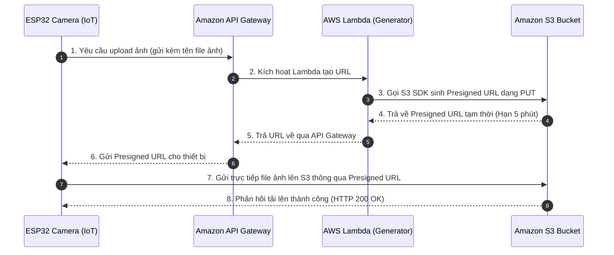

Trong phần này, chúng ta sẽ thiết lập **Amazon S3 Bucket** để lưu trữ hình ảnh biển số xe do ESP32 Camera chụp được và cấu hình **CORS** để hỗ trợ tải ảnh trực tiếp, cũng như tìm hiểu cơ chế bảo mật **S3 Presigned URL**.

---

### Bước 1: Tạo Amazon S3 Bucket
1. Mở **AWS Management Console** và tìm kiếm dịch vụ **S3**.
2. Nhấp chọn **Create bucket**:
   - **Bucket name**: Nhập tên duy nhất toàn cầu, ví dụ: `smart-parking-plates-storage-xxx` (thay `xxx` bằng chuỗi số ngẫu nhiên của bạn).
   - **AWS Region**: Chọn khu vực trùng với các tài nguyên AWS khác của bạn (khuyến nghị: `ap-southeast-1` - Singapore).
   - **Object Ownership**: Chọn **ACLs disabled (recommended)** để quản lý quyền truy cập thông qua IAM Policies.
   - **Block Public Access settings for this bucket**: Giữ nguyên chọn **Block all public access** (Bật tính năng chặn mọi truy cập công khai).
3. Nhấp chọn **Create bucket** ở cuối trang để hoàn tất tạo.


*(Minh chứng: Ảnh chụp màn hình trang tạo S3 Bucket thành công hiển thị bucket ở trạng thái Private)*

---

### Bước 2: Cấu hình CORS (Cross-Origin Resource Sharing) cho S3
Vì ứng dụng web frontend và thiết bị phần cứng (ESP32) sẽ gửi request trực tiếp (HTTP PUT) tới S3 Bucket từ các nguồn (Origin) khác nhau, chúng ta cần cấu hình CORS để S3 cho phép các luồng tải lên này.

1. Nhấp chọn tên S3 Bucket vừa tạo.
2. Chuyển sang tab **Permissions** và cuộn xuống dưới cùng tại mục **Cross-origin resource sharing (CORS)**.
3. Chọn **Edit** và dán đoạn cấu hình JSON dưới đây vào:
   ```json
   [
     {
       "AllowedHeaders": [
         "*"
       ],
       "AllowedMethods": [
         "PUT",
         "POST",
         "GET"
       ],
       "AllowedOrigins": [
         "*"
       ],
       "ExposeHeaders": []
     }
   ]
   ```
4. Chọn **Save changes** để lưu cấu hình.


*(Minh chứng: Ảnh chụp màn hình phần thiết lập Permissions CORS trên S3 Bucket)*

---

### Bước 3: Tìm hiểu Cơ chế Bảo mật S3 Presigned URL

#### 1. S3 Presigned URL là gì?
Mặc định, tất cả các đối tượng (ảnh) trong S3 Bucket của chúng ta đều ở chế độ riêng tư (Private). Thiết bị ESP32 Camera muốn tải ảnh lên S3 phải cần thông tin xác thực AWS (Access Key & Secret Key). Tuy nhiên, việc lưu trữ trực tiếp các Key này trên vi điều khiển ESP32 là cực kỳ nguy hiểm.

**S3 Presigned URL** giải quyết triệt để vấn đề này. Đây là một đường dẫn URL tạm thời được tạo ra và ký bằng chứng chỉ AWS của hệ thống Serverless, cho phép bất kỳ ai có URL này có thể thực hiện tải ảnh lên (PUT) hoặc xem ảnh (GET) mà **không cần thông tin đăng nhập AWS**, và URL này sẽ **tự động hết hạn** sau một khoảng thời gian thiết lập trước (ví dụ: 5 phút).

#### 2. Luồng hoạt động (Workflow):


Ở các bài tiếp theo trong Workshop, chúng ta sẽ viết code Lambda để sinh ra URL này, và viết code ESP32 để nhận URL và thực hiện đẩy ảnh lên S3.
